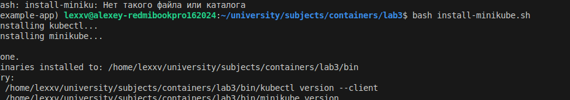
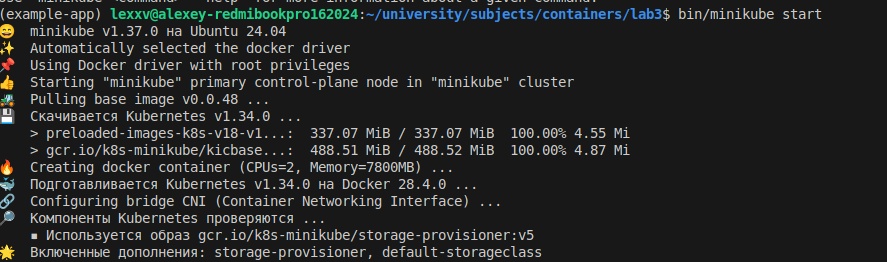
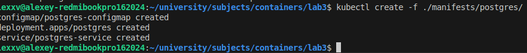
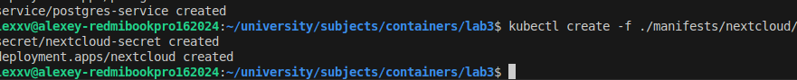
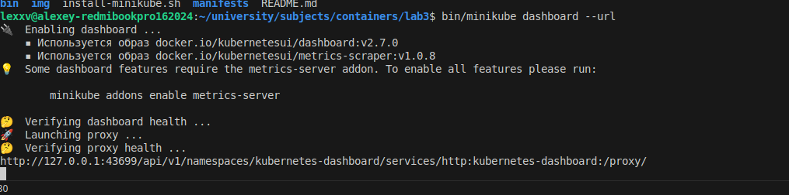
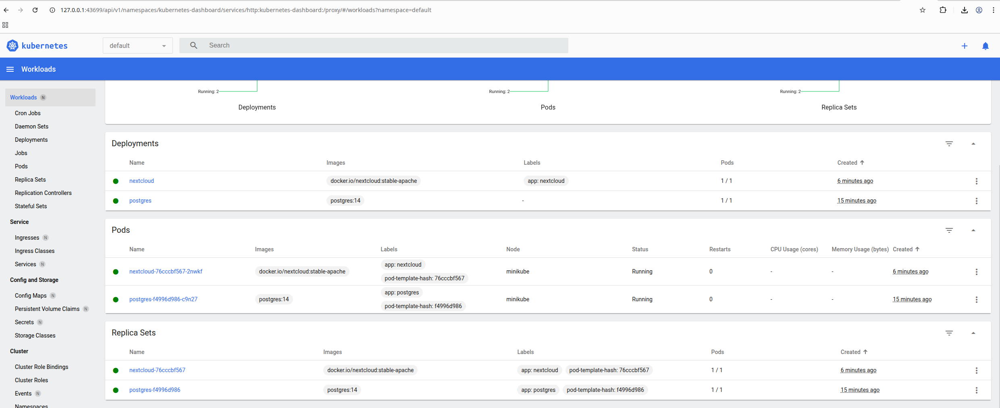

# Лабораторная работа 3

## Ход работы

1. Установлены нужные бинарники (kubectl и minikube) в локальную папку.



2. Сконфигурирован minikube.



3. Созданы манифесты для PostgreSQL.

4. Созданы ресурсы PostgreSQL в minikube с помощью kubectl .



5. Созданы манифесты для NextCloud.

6. Созданы ресурсы NextCloud в minikube с помощью kubectl.



7. Установлен компонент dashboard для minikube.



7. Открыт и изучен дашборд.



## Задания

1. Для постгреса создан отдельный манифест с секретами и обновлён deployment.

```yaml
apiVersion: v1
kind: Secret
metadata:
  name: postgres-secret
  labels:
    app: postgres
type: Opaque
stringData:
  POSTGRES_USER: "postgres"
  POSTGRES_PASSWORD: "pazzword"
```

Обновленные энвы
```yaml
env:
- name: POSTGRES_DB
  valueFrom:
    configMapKeyRef:
      name: postgres-configmap
      key: POSTGRES_DB
- name: POSTGRES_USER
  valueFrom:
    secretKeyRef:
      name: postgres-secret
      key: POSTGRES_USER
- name: POSTGRES_PASSWORD
  valueFrom:
    secretKeyRef:
      name: postgres-secret
      key: POSTGRES_PASSWORD
```

Также ресурсы PG были обновлены командами:

```bash
kubectl create -f ./manifests/postgres/pg_secret.yml
kubectl replace -f ./manifests/postgres/pg_deployment.yml
```

2. Для NEXTCLOUD создан отдельный манифест с конфигом и обновлён deployment.

```yaml
apiVersion: v1
kind: ConfigMap
metadata:
  name: nextcloud-configmap
  labels:
    app: nextcloud
data:
  NEXTCLOUD_UPDATE: '1'
  NEXTCLOUD_TRUSTED_DOMAINS: "127.0.0.1"
```

Энвы в деплойменте были также обновлены.

Также ресурсы NEXTCLOUD были обновлены командами:

```bash
kubectl create -f ./manifests/nextcloud/nextcloud_configmap.yml
kubectl replace -f ./manifests/nextcloud/nextcloud.yml
```

3. Добавлены пробы для некстклауда

```yaml
readinessProbe:
    httpGet:
    path: /status.php
    port: http
    initialDelaySeconds: 20
    periodSeconds: 10
    timeoutSeconds: 3
    failureThreshold: 6
livenessProbe:
    httpGet:
    path: /status.php
    port: http
    initialDelaySeconds: 60
    periodSeconds: 20
    timeoutSeconds: 3
    failureThreshold: 3
```

## Ответы на вопросы:

1. Что (и почему) произойдет, если отскейлить
количество реплик postgres-deployment в 0, затем обратно в 1,
после чего попробовать снова зайти на Nextcloud?

Ответ:
Скейл Postgres в 0 -> Pod удаляется, БД исчезает вместе со всеми данными (т.к. нет volume). Nextcloud начинает падать/отдавать ошибки, потому что не к чему подключаться.

Скейл обратно в 1 -> поднимается чистый пустой Postgres.

2. Важен ли порядок выполнения этих манифестов?
Почему?

Ответ: В целом порядком применения можно пренебречь т.к. k8s самостоятельно "перезапускает" процесс доведения ресурсов в требуемое состояния при появлении нового зависимого ресурса. Но порядок так или иначе имеет значение т.к в данном случае сервис - зависит от деплоймента, а деплоймент от конфигмапы.
