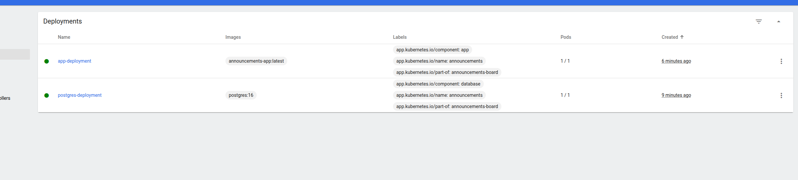
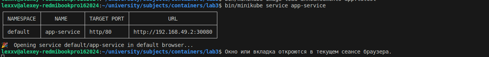
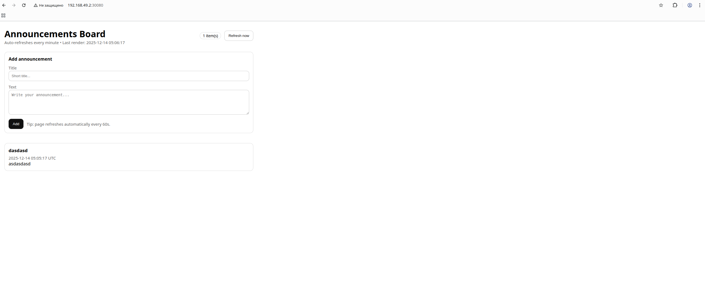

# Лабораторная работа 4

## Ход работы

1. Были созданы следующие ресурсы:

### ConfigMap
- `postgres-config` — хранит `POSTGRES_DB`.
- `app-config` — хранит `PGHOST`, `PGPORT`, `PGDATABASE` для приложения.
- `init-sql` — хранит SQL-скрипт `init.sql` для создания схемы/таблицы/индекса.

### Secret
- `postgres-secret` — хранит `POSTGRES_USER` и `POSTGRES_PASSWORD`.

### PersistentVolumeClaim
- `postgres-pvc` — постоянное хранилище для данных Postgres (`/var/lib/postgresql/data`).

### Deployment
- `postgres-deployment` — Postgres (1 реплика), использует PVC, содержит readiness/liveness пробы.
- `app-deployment` — приложение (1 реплика) + `initContainer`:
  - initContainer `init-db` ждёт Postgres и применяет SQL из `init-sql`;
  - основной контейнер запускает кастомный образ `announcements-app:latest` (для minikube `imagePullPolicy: Never`);
  - содержит readiness/liveness пробы по `/healthcheck`.

### Service
- `postgres-service` (ClusterIP) — доступ к Postgres внутри кластера по DNS имени `postgres-service:5432`.
- `app-service` (NodePort) — доступ к приложению снаружи кластера через порт `30080` (внутри контейнера `5000`).

2. Далее раздеплоен постгрес


3. Загружен локальный образ в minikube с помощью команды:
```bash
bin/minikube image load announcements-app:latest
```

3. Далее раздеплоено основное приложение с инит контейнером



4. Теперь получаем доступ к приложению с помощью команды
```bash
bin/minikube service app-service
```



В итоге получаем рабочее приложение:


